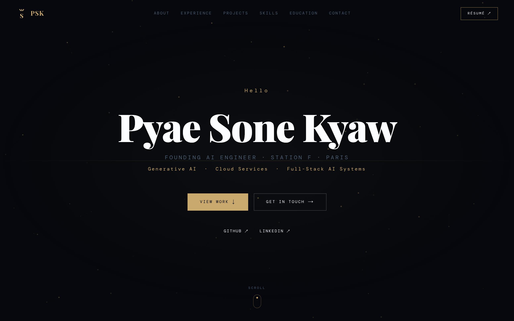

# Seon's Portfolio

A production-grade personal portfolio built with **Next.js 16**, **React 19**, **TypeScript**, and **Tailwind CSS 4**. Statically generated for performance, fully typed for reliability, and designed with a dark luxury aesthetic.

**Live site:** [Coming soon on Vercel]

<p align="center">
  
</p>

---

## About

This portfolio showcases my work as a **Founding AI Engineer at Siloett.AI** (Station F, Paris). It covers my experience across AI/ML, full-stack engineering, and research — from building RAG pipelines and agentic systems to shipping production applications.

**Highlights:**

- 4+ years in AI/ML and data science
- Dual Master's degrees (Telecom SudParis, Paris + Asian Institute of Technology, Bangkok)
- 36+ technical skills across AI/ML, cloud, frontend, backend, and DevOps
- Projects spanning CreativeAI, RegTech, NLP, and computer vision

---

## Tech Stack

| Layer      | Technology                          |
| ---------- | ----------------------------------- |
| Framework  | Next.js 16 (App Router, SSG)        |
| UI         | React 19, TypeScript (strict mode)  |
| Styling    | Tailwind CSS 4 with custom tokens   |
| Fonts      | Playfair Display, DM Mono, DM Sans  |
| Animations | CSS keyframes, IntersectionObserver |
| Images     | next/image (WebP/AVIF auto-serve)   |
| Deployment | Vercel                              |

---

## Features

- **Neural flow graph** — DAG canvas visualization with animated data pulses flowing through bezier-curve edges, replacing generic particle effects
- **Glitch text effect** — CSS-driven name animation
- **3D tilt cards** — mouse-tracked perspective on project cards
- **SVG orbital** — animated skill visualization with counter-rotating icons
- **Mobile responsive navbar** — hamburger menu with slide-in drawer, body scroll lock, and close-on-navigate
- **Active section indicator** — IntersectionObserver-powered nav highlighting with animated underline
- **Scroll reveal** — viewport-triggered section animations via IntersectionObserver
- **Clipboard integration** — one-click email copy with visual feedback and `aria-live` screen reader announcements
- **Image optimization** — `next/image` with automatic WebP/AVIF serving and lazy loading
- **Accessibility** — focus-visible outlines, semantic `<button>` elements, ARIA labels, keyboard-navigable
- **Fully responsive** — optimized for mobile, tablet, and desktop
- **Static generation** — zero runtime server, fast global delivery

---

## Project Structure

```
src/
├── app/
│   ├── layout.tsx            # Root layout, fonts, metadata
│   ├── page.tsx              # Home page composing all sections
│   └── globals.css           # Tailwind config + custom animations
├── components/
│   ├── navbar.tsx            # Responsive nav with mobile drawer + active section indicator
│   ├── hero.tsx              # Neural flow graph canvas + glitch text
│   ├── about.tsx             # Bio, stats, tech marquee
│   ├── experience.tsx        # Timeline with color-coded roles
│   ├── projects.tsx          # Featured + additional project cards
│   ├── skills.tsx            # SVG orbital + categorized skill list
│   ├── education.tsx         # Degree cards + journey banner
│   ├── certifications.tsx    # Certification cards
│   ├── contact.tsx           # Email clipboard + social links
│   └── footer.tsx            # Footer
├── lib/
│   ├── data.ts               # All portfolio content (single source of truth)
│   └── hooks.ts              # Custom hooks (useScrollReveal, useActiveSection)
└── types/
    └── portfolio.ts          # TypeScript interfaces
```

---

## Getting Started

```bash
# Install dependencies
npm install

# Start development server
npm run dev

# Production build
npm run build

# Type check
npm run typecheck

# Lint
npm run lint
```

Requires **Node.js 20+**.

---

## Design System

The site uses a custom dark theme with gold accents, defined as Tailwind CSS theme tokens:

- **Backgrounds:** `bg`, `bg2`, `surface`, `border`
- **Text:** `text`, `muted`, `body`, `body-dim`
- **Accent:** `accent` / `accent-light` — gold (#C9A96E)
- **Category colors:** `blue`, `purple`, `green`, `warm`, `red` for skill and role categorization

Typography is set in **Playfair Display** (headings), **DM Sans** (body), and **DM Mono** (code/tags).

---

## Featured Projects

| Project         | Description                                       | Stack                                             |
| --------------- | ------------------------------------------------- | ------------------------------------------------- |
| **VaxEvidence** | Real-world evidence platform for vaccine research | Next.js, React, TypeScript, Supabase              |
| **SafeGen.dev** | Responsible AI compliance middleware for LLM apps | React, TypeScript, Azure Functions, FAISS, GPT-4o |
| **DocuQuery**   | AI-powered resume-job match analysis platform     | Next.js, FastAPI, TypeScript, PostgreSQL, OpenAI  |

---

## License

This project is personal portfolio source code. Feel free to reference the architecture and patterns, but please don't copy the content or present it as your own.
