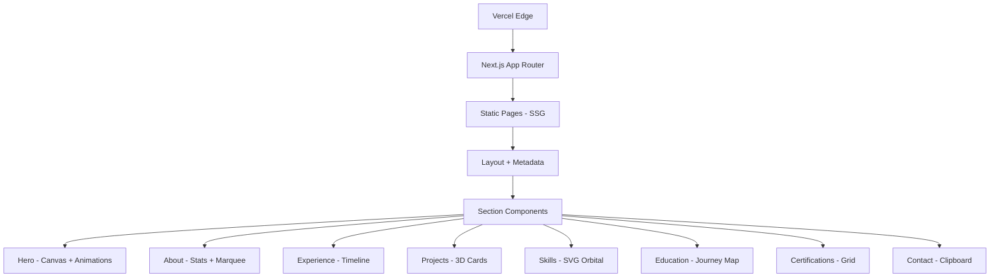

# PRD: Seon's Portfolio

> **Status:** In Review
> **Author:** Pyae Sone (Seon)
> **Date:** 2026-03-05
> **Last Updated:** 2026-03-05

---

## 1. Problem Statement

### What problem are we solving?

Seon's portfolio exists as a single monolithic JSX file with inline styles (~860 lines). While visually impressive, it lacks TypeScript safety, proper component architecture, Tailwind-based styling, SEO optimization, and a maintainable project structure. It needs to be migrated to a production-grade Next.js application.

### Who has this problem?

- **Recruiters & hiring managers** evaluating Seon for AI engineering roles
- **Potential collaborators** and startup founders looking for technical co-founders
- **Seon himself** needing a maintainable, fast, SEO-optimized portfolio

### Why now?

The current JSX file works but is fragile — no types, no tests, no SEO, no component separation. Migrating to Next.js + TypeScript + Tailwind CSS creates a professional foundation that's easy to update and deploy.

---

## 2. Success Criteria

### Primary Metric

Portfolio loads in under 2 seconds on mobile (Lighthouse Performance > 90).

### Secondary Metrics

- [ ] Lighthouse SEO score > 95
- [ ] Lighthouse Accessibility score > 90
- [ ] Zero TypeScript errors in strict mode
- [ ] All sections render identically to the original design
- [ ] Deployed and live on Vercel

### What does "done" look like?

A pixel-faithful migration of the existing portfolio to Next.js 15 + TypeScript + Tailwind CSS, with proper component architecture, SEO metadata, responsive design, and deployed to Vercel.

---

## 3. User Stories & Acceptance Criteria

### Story 1: View Portfolio Sections

**As a** recruiter, **I want to** browse through all portfolio sections (Hero, About, Experience, Projects, Skills, Education, Certifications, Contact), **so that** I can evaluate Seon's qualifications.

**Acceptance Criteria:**

- [ ] Given I land on the site, when the page loads, then I see the Hero section with animated greeting, name with glitch effect, and particle canvas
- [ ] Given I scroll down, when each section enters the viewport, then it animates in with reveal/slide transitions
- [ ] Given I'm on any section, when I click a nav link, then the page smooth-scrolls to that section

### Story 2: Navigate and Interact

**As a** visitor, **I want to** use the navigation bar and interactive elements, **so that** I can explore the portfolio efficiently.

**Acceptance Criteria:**

- [ ] Given I scroll past 60px, when the nav becomes visible, then it shows a frosted glass background with blur
- [ ] Given I hover over project cards, when my cursor moves, then the cards tilt with 3D perspective effect
- [ ] Given I hover over skill orbital, when icons orbit, then they counter-rotate to stay upright
- [ ] Given I click "RESUME", when the link activates, then it opens/downloads the resume PDF

### Story 3: Contact and Connect

**As a** hiring manager, **I want to** contact Seon easily, **so that** I can discuss opportunities.

**Acceptance Criteria:**

- [ ] Given I'm on the Contact section, when I click the email button, then the email is copied to clipboard with visual confirmation
- [ ] Given I see social links, when I click GitHub or LinkedIn, then they open in a new tab
- [ ] Error state: when clipboard API is unavailable, then fail silently without breaking the UI

### Story 4: Mobile Responsive Experience

**As a** visitor on mobile, **I want to** view the portfolio on any device, **so that** I get a quality experience regardless of screen size.

**Acceptance Criteria:**

- [ ] Given I'm on a phone (< 768px), when I view the site, then all sections stack vertically and are readable
- [ ] Given I'm on a tablet, when I view the site, then the grid layouts adapt to the available width
- [ ] Given I'm on any device, when I view text, then font sizes scale with clamp() for readability

### Story 5: SEO and Performance

**As a** search engine crawler or link previewer, **I want to** index the portfolio properly, **so that** Seon's portfolio appears in search results and looks good when shared.

**Acceptance Criteria:**

- [ ] Given a search engine crawls the site, when it reads metadata, then it finds proper title, description, and Open Graph tags
- [ ] Given someone shares the link on LinkedIn/Twitter, when the preview renders, then it shows a proper card with title and description
- [ ] Given the site loads, when Lighthouse audits run, then Performance > 90, SEO > 95

---

## 4. Technical Architecture

### Stack Decision

| Layer    | Choice                | Why                                               |
| -------- | --------------------- | ------------------------------------------------- |
| Frontend | Next.js 15 + React 19 | SSG for performance, App Router, SEO built-in     |
| Styling  | Tailwind CSS 4        | Utility-first, matches Seon's stack preferences   |
| Language | TypeScript (strict)   | Type safety, catch errors at build time           |
| Fonts    | next/font             | Self-hosted Google Fonts, no layout shift         |
| Anim     | CSS + Framer Motion   | Smooth scroll reveals, canvas stays vanilla       |
| Testing  | Vitest + Playwright   | Unit tests for components, E2E for critical flows |
| Hosting  | Vercel                | Zero-config Next.js deployment, preview deploys   |
| CI/CD    | GitHub Actions        | Lint + test + build on every push                 |

### Architecture Diagram



### Project Structure

```
src/
├── app/
│   ├── layout.tsx          # Root layout, fonts, metadata
│   ├── page.tsx            # Home page composing all sections
│   └── globals.css         # Tailwind imports + custom animations
├── components/
│   ├── ui/                 # Reusable primitives (SectionHeader, Tag, etc.)
│   ├── navbar.tsx          # Fixed navigation
│   ├── hero.tsx            # Hero with canvas + glitch
│   ├── about.tsx           # About section
│   ├── experience.tsx      # Experience timeline
│   ├── projects.tsx        # Project cards with 3D tilt
│   ├── skills.tsx          # SVG orbital + skill list
│   ├── education.tsx       # Education cards + journey
│   ├── certifications.tsx  # Certification cards
│   ├── contact.tsx         # Contact + clipboard
│   └── footer.tsx          # Footer
├── lib/
│   ├── data.ts             # All portfolio data (typed)
│   └── hooks.ts            # Custom hooks (useScrollReveal, etc.)
├── types/
│   └── portfolio.ts        # TypeScript interfaces
└── __tests__/              # Test files
```

### Third-Party Dependencies

| Dependency    | Purpose                  | Risk Level | Alternative      |
| ------------- | ------------------------ | ---------- | ---------------- |
| next          | Framework                | Low        | None             |
| tailwindcss   | Styling                  | Low        | CSS Modules      |
| framer-motion | Scroll reveal animations | Low        | CSS only         |
| @next/font    | Font optimization        | Low        | Google Fonts CDN |

---

## 5. Edge Cases & Error Handling

| Scenario                   | Expected Behavior                                      | Priority |
| -------------------------- | ------------------------------------------------------ | -------- |
| Image fails to load        | Show PSK fallback (already in original)                | P0       |
| Canvas not supported       | Graceful degradation, hide particle background         | P1       |
| Clipboard API unavailable  | Fail silently, email still visible for manual copy     | P1       |
| External logo CDN down     | img onError hides broken image                         | P1       |
| Very small screen (<320px) | Content remains readable with min font sizes           | P2       |
| Reduced motion preference  | Disable animations via prefers-reduced-motion          | P1       |
| JS disabled                | Static content still visible (SSG), animations degrade | P2       |

### Security Considerations

- [ ] No user input fields (static site) — minimal attack surface
- [ ] External links use `rel="noopener noreferrer"`
- [ ] No secrets required — fully static
- [ ] CSP headers configured via next.config

---

## 6. Testing Strategy

### Unit Tests (Vitest)

- [ ] Data file exports correct typed structures
- [ ] Custom hooks (useScrollReveal) behave correctly
- [ ] Components render without errors
- [ ] Clipboard copy function handles success/failure

### E2E Tests (Playwright)

- [ ] Page loads and all sections are visible
- [ ] Navigation smooth-scrolls to correct sections
- [ ] Project card links open correctly
- [ ] Email copy button works
- [ ] Mobile responsive layout at 375px, 768px, 1280px

### What NOT to test

- Canvas particle animation internals (visual, not logic)
- SVG orbital rotation (CSS animation, not testable in unit tests)
- External link destinations (third-party, not our concern)

---

## 7. Milestones & Build Order

### Phase 1: Foundation (Session 1)

- [ ] Next.js 15 project scaffolding with TypeScript strict mode
- [ ] Tailwind CSS 4 configuration with custom design tokens
- [ ] Font setup (Playfair Display, DM Mono, DM Sans)
- [ ] Data layer: typed data file with all portfolio content
- [ ] Custom CSS animations (keyframes from original)
- [ ] CI pipeline (lint + type-check + build)
- **Gate:** `npm run build` passes, types clean, lint clean

### Phase 2: Component Migration (Session 2-3)

- [ ] Navbar component with scroll-aware styling
- [ ] Hero section with canvas particle system + glitch text
- [ ] About section with stats grid + tech marquee
- [ ] Experience section with timeline
- [ ] Projects section with 3D tilt cards
- [ ] Skills section with SVG orbital
- [ ] Education section with journey banner + cards
- [ ] Certifications section with shimmer cards
- [ ] Contact section with clipboard
- [ ] Footer component
- [ ] Scroll reveal hook/animations
- **Gate:** All sections render, visually match original, types clean

### Phase 3: Polish & Ship (Session 4)

- [ ] SEO metadata (title, description, OG tags)
- [ ] Responsive testing and fixes
- [ ] prefers-reduced-motion support
- [ ] Lighthouse audit (target: 90+ across all metrics)
- [ ] Vitest unit tests
- [ ] Playwright E2E tests
- [ ] Deploy to Vercel
- **Gate:** Lighthouse > 90, tests pass, deployed

---

## 8. Out of Scope (Explicitly)

- NOT building: Blog/CMS functionality
- NOT building: Dark/light theme toggle (already dark theme only)
- NOT building: Backend API or database
- NOT building: Contact form with email sending (clipboard copy is sufficient)
- NOT building: Analytics dashboard
- NOT building: Internationalization (i18n)
- Will revisit in v2: Blog, project detail pages, analytics

---

## 9. Open Questions

- [x] Deploy to Vercel? **Yes**
- [x] Use Framer Motion or CSS-only for reveals? **Start CSS-only, add Framer if needed**
- [ ] Custom domain? (Can configure later)

---

## 10. Approval

- [ ] **PRD reviewed and understood** — I (Seon) confirm the requirements are clear
- [ ] **Architecture approved** — The technical approach makes sense
- [ ] **Scope locked** — No features will be added during build without updating this PRD

> **Once approved, this PRD becomes the source of truth. Every feature, every endpoint, every component traces back to a user story above. If it's not in the PRD, it's not getting built.**
